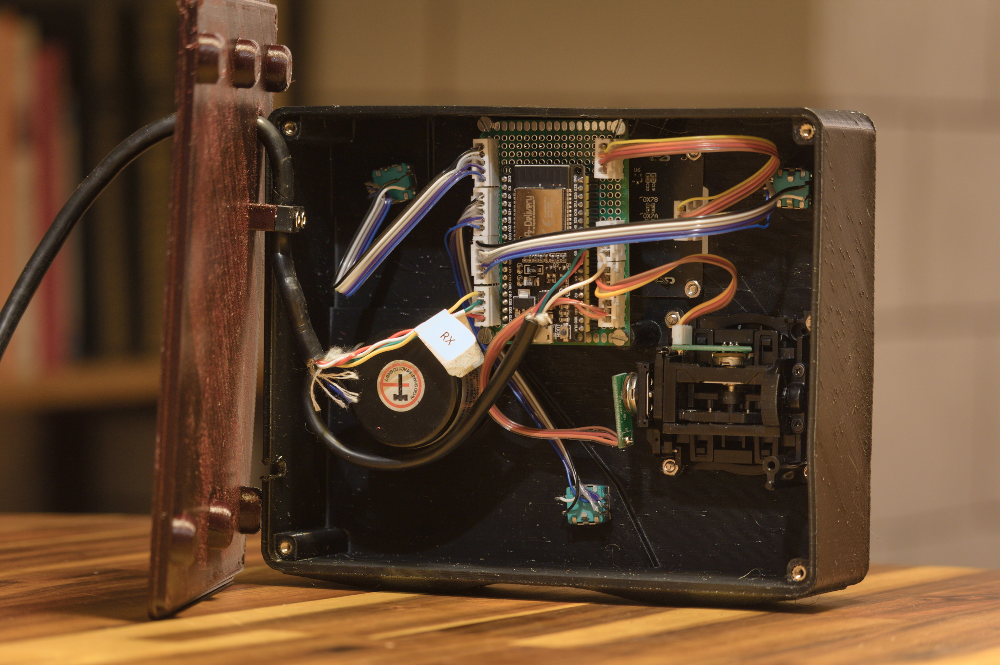

# grblHal_pendant

This is a simple pendant for [grblHal](https://github.com/grblHAL/core) controlled cnc machines. It is running on an ESP32. For the analog feel it is using a high resolution rotary encoder (with 600 pulses per revolution), and an analog joystick for rapid movement.

There are in total 3 EC11 rotary encoders with button functionality. Two to dial in the feed and spindle overrides, and one for navigating the menu. The display is a I2C OLED (SSD1309) with 128x64 pixel resolution.

I chose those components mostly because I already had them laying around — the rotary encoder came out of an old pendant I made for 8bit grbl back then, the joystick out of an old RC controller. EC11s and the OLED display can be ordered very cheaply from China.

I am aware that my choice for the encoder for jogging is a little bit unconventional, and therefore building a pendant like this is not for everyone, but at least some code snippets might be useful for others.

All the jogging, regardless if joystick or encoder, is done by reading the input device at a frequency of 10Hz. I figured that is a good frequency to feed jogging commands to grbl or grblHal. The revolution of the rotary encoder is translated directly into the revolution of my ball screw, so one revolution moves the machine by 5mm. 1200 pulses per revolution means that one pulse equals 0.0042mm movement. With the given time interval of 0.1 seconds the feed is easy to calculate and it has the nice side effect that there is no need for any stop-jog real-time commands. This gives a pretty secure feeling when jogging.

I personally often like to touch off with a running spindle, when preparing stock with an indexed end mill for example. And like this, this feels really smooth.

The UART mode of grblHal is enabled and disabled automatically. So you can switch between the computer and pendant without pressing any buttons. GrblHal needs to be configured with UART mode enabled and rt command for switching over.

---

## Building

The code uses the Arduino framework and a few libraries:

- **U8g2lib.h** and **Wire.h** – for the display  
- **Button.h** and **AiEsp32RotaryEncoder.h** – for the buttons of the EC11 encoders  
- **Preferences.h** – for saving settings in the ESP32  
- **queue** – for streaming gcode  
- **math.h**

It can be compiled and uploaded with the Arduino IDE or the Arduino CLI tools.

Pin assignments and the definition of the pulses per revolution of the rotary encoder can be found in `config.h`. The analog joystick needs to be calibrated first; this can be done in the menu of the pendant. This is important — otherwise the machine might move unexpectedly as soon as joystick input is selected.

---

## Hardware

In the hardware folder is a schematic and CAD files of the case. I am using 3mm alu dipond as front panel (again, because I found some in my garage). 3mm is a pretty unusual thickness for front panels, so most likely the model needs to be adapted a little, or just 3D-print a spacer that goes under the panel.

And yes, the case is quite big — that's because I'm not a big fan of handheld devices. I prefer it mounted to the CNC so I have one hand free to slide a parallel around on the work piece or similar.

List of components:

- 1 rotary encoder LPD3806-600BM-G5-24G (rated for 5-24v, but works fine with 3v3)
- 3 rootary encoders EC11
- 1 OLED display 128x64 pixel I2C with SSD1309 driver
- 1 analog joystick
- 1 ESP32 Development board
- cables and connectors

---

## USE

All the pins, the pulses per revolution of the rotary encoder for jogging and the distance pro revolution are set in config.h.
When it's all connected, and the firmware is flashed the display should show up. 
It needs to be setup in Menu -> Settings:

- Joystick settings
  - Calibrate Joystick - calibration process for the analog joystick 
  - joystick invert X, Y - invert the axis
  - set joystick speed - it is not a real world unit. Standard is 3, 5 gives you about 4200 mm/min feed when jogging full speed in xy direction (diagonal), if Z is moved simultaneous, the feed is higher.

- Encoder settings - invert X, Z and Z
- delay compensation - compensates for delay (processing, acceleration). smaller value give a directer control, less overshoot, higher value smoother movement in higher speeds. Default is 0, values like 0.1 to 0.25 can smoothen joystick jogging

- **Button.h** and **AiEsp32RotaryEncoder.h** – for the buttons of the EC11 encoders  

---

## Disclaimer

Use at your own risk: read the source code first. Don't crash the machine or even hurt yourself.
